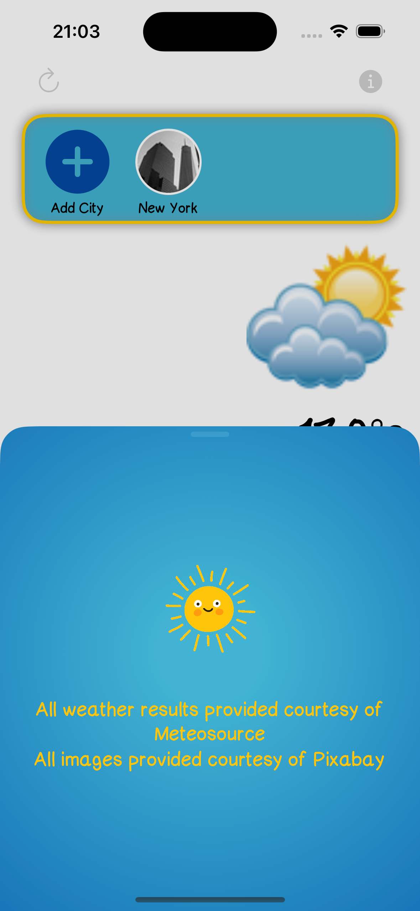
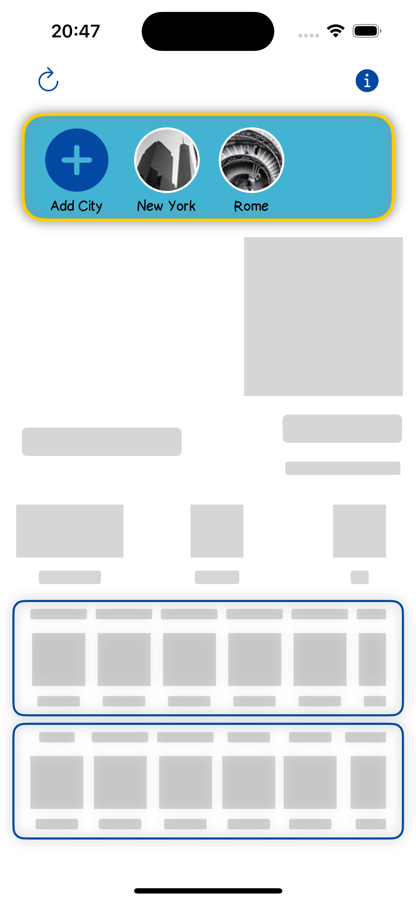
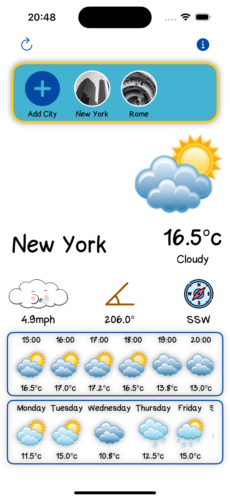
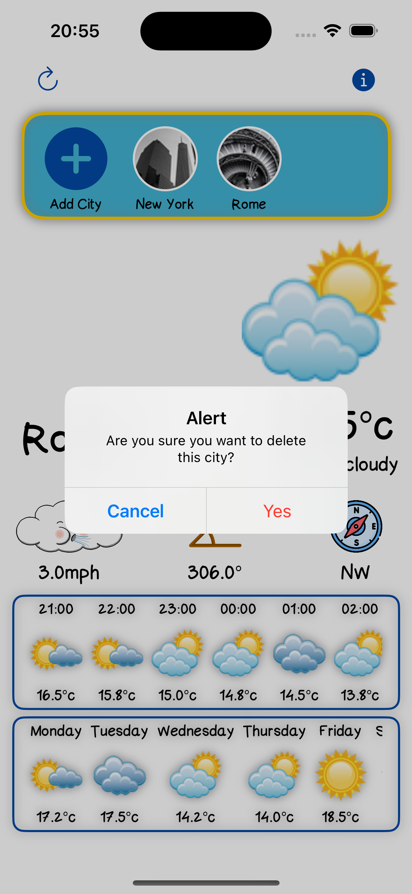
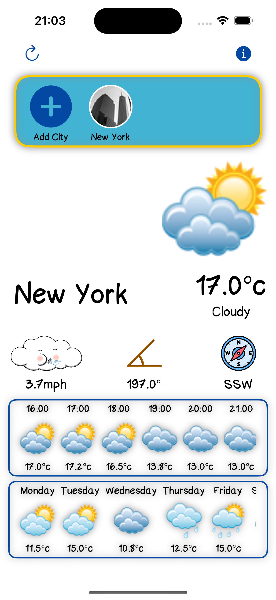
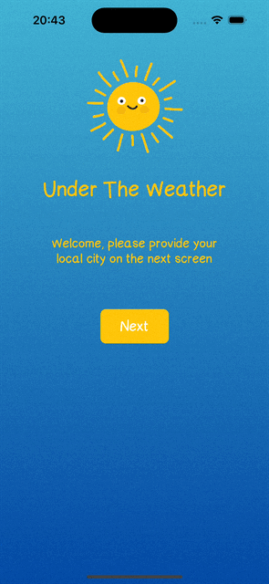

<h1 align="center">

Under The Weather 🌦

</h1>

## Objective
Create a weather app, with search functionality providing user with options to save 5 locations.

## Progress
- Initial load screen complete
- City search bar and results table complete
- Router implemented for navigation
- All screens now connected via Router
- Add and delete functionality for UserDefaults
- Setup onboarding parameter for showing setup screen for first time users
- Published Value now updates CityCollectionView 
- Long press delete functionality
- About modal
- Snap to grid
- Coordinator navigation
- testing update
- Fixed race condition related to mismatching weather and city names
- Skeleton loading view

## Improvements
- Caching weatherData
- Providing thread safety for localStorage

## Testing
6/6 unit test

## Screenshots
  
 

## Demo
| Onboarding | Add a city |
| ----------- | ----------- |
|  |  |

## Tech Stack
Swift, UIKit, SwiftUI, MVVM, Coordinator

## Simulator version
13 Pro

## Dependencies
- Compass
